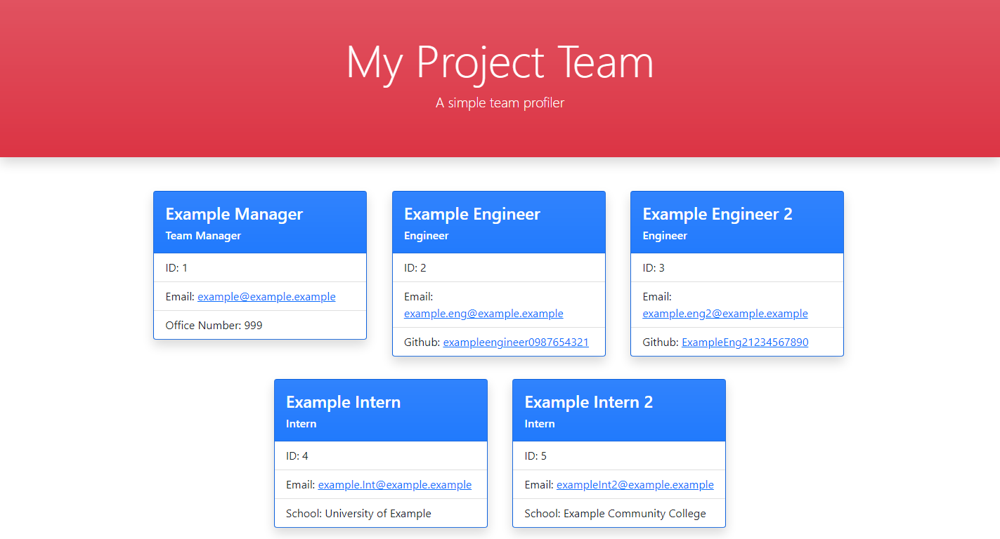

#  Project Team Generator   

  ##  Description

***

  A simple command line tool for creating a Project Team Profile and generating an HTML file (with styling) for GitHub applications. Uses JavaScript, Node.js, Inquirer, and FS.

  Included are shell scripts for Linux bash, Powershell, and CMD, all of which will allow you to run the program from any directory on your machine.
  
  ## Table Of Contents  

***
  * [Description](#Description)
  * [Table Of Contents](#table-of-contents)
  * [Installation](#Installation)
  * [Usage Instructions](#usage-instructions)
  * [Contribution Guidelines](#contribution-guidelines)
  * [Testing Instructions](#testing-instructions)
  * [License](#License)
  * [Questions?](#questions)

  ##  Installation

*** 

  ### Clone the repository: 
    git clone git@github.com:pharaohnof/project-team-generator.git  
      
  ### Dependencies:  
  The following dependencies are required for use:  
 * Node.JS - Inquirer - FS - util - and Jest for testing  
  
  ### Additional Installation Instructions:

    
  * Node.js is required to run this application, install it from your preferred package manager. Clone the above repository to your directory of choice. If you wish to use the included shell scripts to run the application from any directory, it is recommended to clone the repo to the following directories:  
  * Linux: `/home/project-team-generator/`  
  * Windows: `C:\"program files"\project-team-generator`  
  * Gitbash for Windows: `/c/'program files'/project-team-generator/`.  
      
  If you choose another directory and want to use the shell scripts, you will need to change the referenced directory in the scripts.  
    
  Once the repo has been cloned, navigate to the specified directory and run `npm install` to install the required dependencies.

  
  *Optional -- to use the shell scripts you must include the file in your PATH. Use `teamgen.cmd` for Powershell and CMD, and `teamgen` for Linux and other bash.*
  - Linux -bash (or Windows Subsytem for Linux) : `/usr/bin/` is a common location in PATH for scripts
  - Windows - Powershell or Command Line : `C:/Windows/System32` is commonly in PATH
  - Gitbash for Windows : `/c/'program files'/Git/usr/bin` is in PATH
    

  ##  Usage instructions  

***
    

  Once the repo is cloned the application may be ran from the installed directory by running `npm start` OR `node teamgen.js` from the command line. The program may also be optionally run from the installed directory by running `node index.js` from the command line (this was included to satisfy a user story requirement, but is not necessary.)  
    
  Answer the questions, and view the HTML and CSS files written to the /dist subdirectory. The HTML file will be filled with input from a command line inquiry.

*Optional -- if you have installed the shell scripts to a directory in your PATH then you can run this application from any directory by entering `teamgen`(bash) or `teamgen.cmd`(powershell) in the command line. Using this option will produce the /dist subdirectory in whatever directory it is ran from. In Linux You may need to change file permissions to run the script, for most users 755 will work fine. navigate to the directory where the script is located and run `chmod 755 teamgen` from the command line.*

See attached instructional video:
(CLICK IMAGE TO VIEW VIDEO)
    
 
  ##  Contribution Guidelines  

***
    
  If you would like to contribute to this project, please [add me on GitHub](https://github.com/pharaohnof)
    
  ##  Testing Instructions  

  ***
    
  run `npm test` from a terminal in the repo directory  
    
  ##  License

  ***
      
  This project is covered under the  license.  
    
  See attached [LICENSE](./LICENSE) file for details.  
    
  ##  Questions?  

  ***
  
  If you have any questions regarding this application you can reach me using the below contact information:  
  ### Contact Info  
    
  GitHub: [pharaohnof](https://github.com/pharaohnof)

  Email:  pharaohnof.software@gmail.com